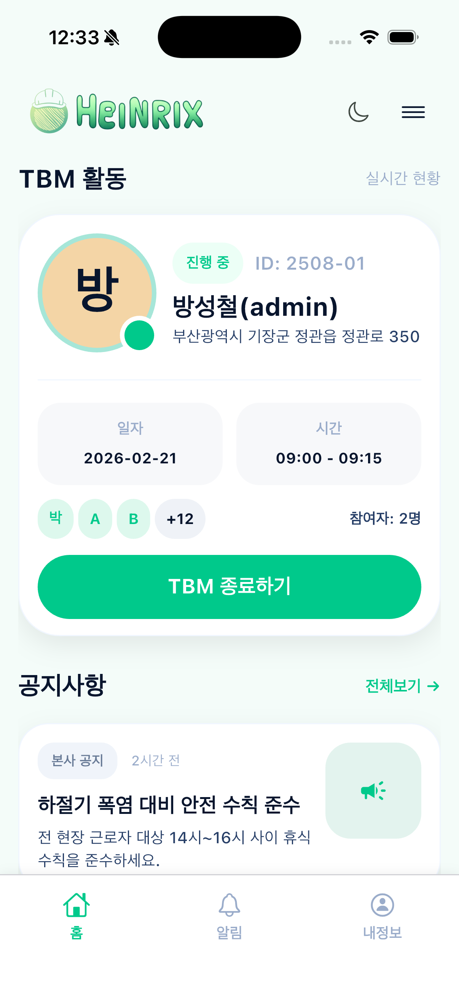
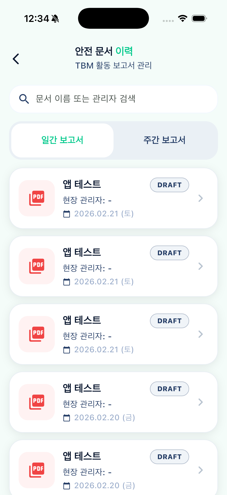
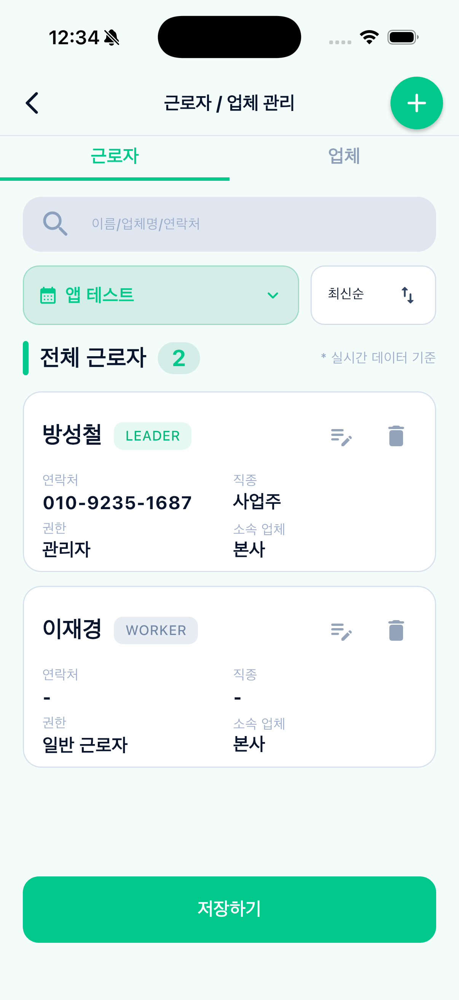
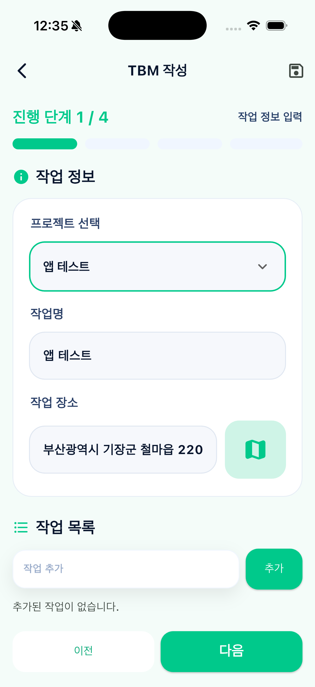
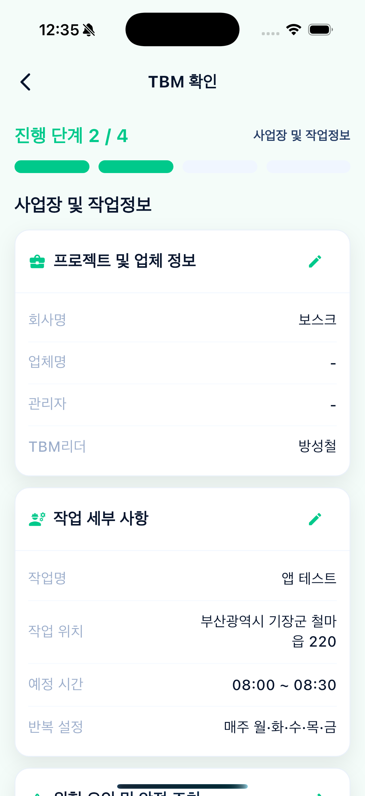
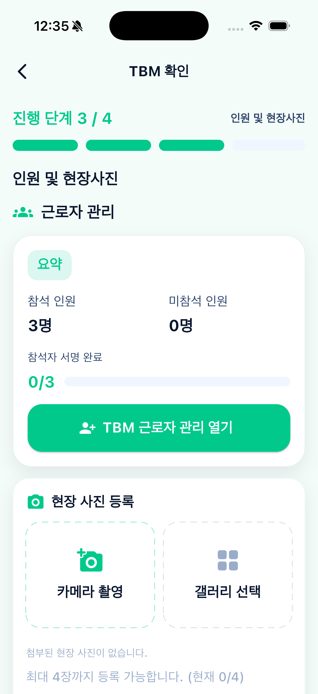
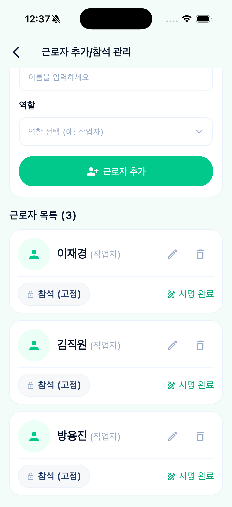
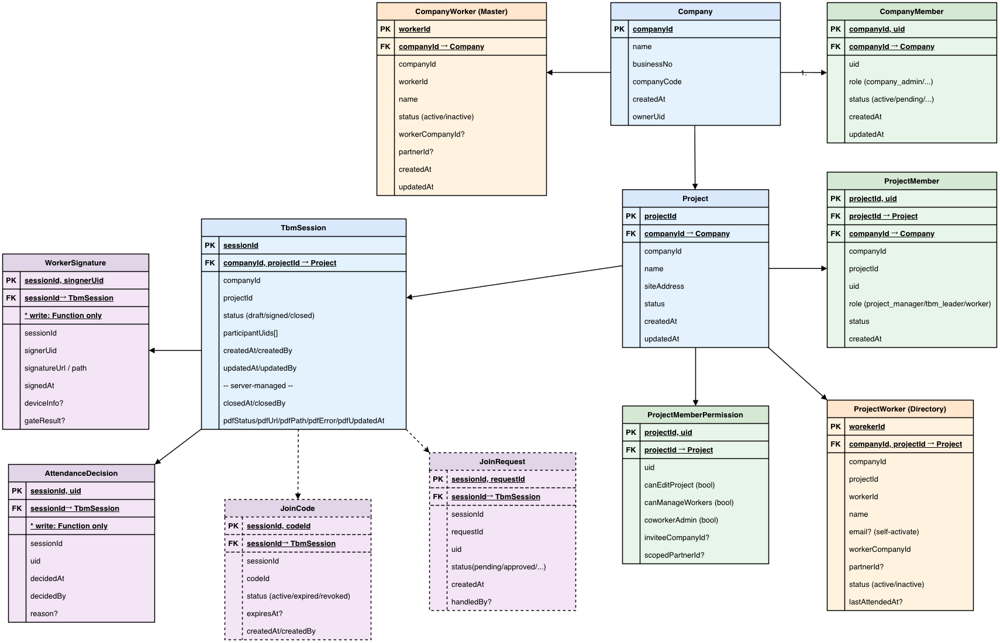

# Heinrix TBM Application

<p align="center">
  
</p>

<p align="center">
  건설 현장 TBM(Tool Box Meeting) 운영을 디지털화한 안전관리 플랫폼
</p>

<p align="center">
  
  
  
  
</p>

## 프로젝트 소개
Heinrix TBM Application은 현장 안전회의(TBM)의 생성, 참여자 관리, 서명 수집, PDF 보고서 생성을 하나의 흐름으로 통합한 앱입니다.  
본사 관리자, 협력업체, 근로자 역할별 운영 시나리오를 지원하며, Firebase 기반으로 실시간 데이터 동기화와 권한 제어를 수행합니다.

## 핵심 기능
- 프로젝트 생성/수정/삭제 및 참여 인원 모드 관리
- 본사/협력업체/근로자 권한 기반 접근 제어
- 현장 참여 요청 및 승인 프로세스
- TBM 참석/서명 관리
- TBM 문서 PDF 자동 생성 및 저장
- Firebase Functions 기반 집계/정합성 처리

## 앱 화면 가이드 (Home + 1~8 PNG)

### Home 화면
- 앱의 메인 대시보드 화면입니다.
- TBM 진행 카드, 공지사항, 하단 네비게이션(홈/알림/내정보)으로 핵심 업무를 빠르게 진입합니다.
- 이미지 링크: [`docs/images/home.png`](docs/images/home.png)



### 1. 메뉴 드로어 (위치 해석 완료)
- 회사/프로젝트 스코프 기준으로 주소가 정상 해석된 상태입니다.
- 운영자는 현재 현장 위치를 ID가 아닌 실제 주소로 확인할 수 있습니다.
- 이미지 링크: [`docs/images/2.png`](docs/images/2.png)


### 2. 회사 찾기 / 초대링크 가입
- 초대 링크 입력으로 회사 참여를 요청하거나, 검색으로 회사/현장을 조회합니다.
- "내 요청 내역" 탭으로 가입 요청 상태를 추적할 수 있습니다.
- 이미지 링크: [`docs/images/3.png`](docs/images/3.png)


### 3. 근로자/업체 관리
- 근로자/업체 탭 기반으로 인력 데이터를 통합 관리합니다.
- 검색, 정렬, 프로젝트 필터, 권한/소속 확인 및 편집이 가능합니다.
- 이미지 링크: [`docs/images/4.png`](docs/images/4.png)



### 4. TBM 보고서 관리
- 안전 문서 이력에서 일간/주간 보고서를 조회하고 검색합니다.
- 세션 상태(DRAFT 등)와 생성일을 기준으로 문서를 식별합니다.
- 이미지 링크: [`docs/images/5.png`](docs/images/5.png)



### 5. TBM 작성 (1/4 작업 정보)
- 프로젝트, 작업명, 작업 장소를 입력하는 첫 단계입니다.
- 하단 작업 목록에 세부 작업 항목을 추가하며 다음 단계로 진행합니다.
- 이미지 링크: [`docs/images/6.png`](docs/images/6.png)



### 6. TBM 확인 (2/4 사업장 및 작업정보)
- 회사/업체/관리자 정보와 작업 세부사항을 검토하는 단계입니다.
- 각 섹션 우측 편집 버튼으로 입력값을 즉시 수정할 수 있습니다.
- 이미지 링크: [`docs/images/7.png`](docs/images/7.png)



### 7. TBM 확인 (3/4 인원 및 현장사진)
- 참석 인원/미참석 인원, 서명 완료 현황을 요약으로 확인합니다.
- 근로자 관리 화면 진입 및 현장 사진 촬영/선택 업로드를 지원합니다.
- 이미지 링크: [`docs/images/8.png`](docs/images/8.png)



### 8. 근로자 추가/참석 관리
- 근로자 추가, 역할 지정, 참석(고정) 상태, 서명 완료 상태를 관리합니다.
- 근로자별 수정/삭제 액션으로 현장 인원 데이터를 실시간 정합화합니다.
- 이미지 링크: [`docs/images/9.png`](docs/images/9.png)



## TBM ERD
- TBM 도메인의 컬렉션 관계(회사/프로젝트/세션/근로자/서명)를 시각화한 ERD를 연결합니다.
- 이미지 링크: [`docs/images/tbm_erd.png`](docs/images/tbm_erd.png)
- 이미지 링크: [`docs/images/tbm_erd_from_firestore_v1.drawio.png`](docs/images/tbm_erd_from_firestore_v1.drawio.png)
- 참고: 현재 저장소에는 `tbm_erd.png` 파일이 없으므로, 동일 경로에 파일 추가 시 즉시 표시됩니다.




## 기술 스택
- Frontend: Flutter, Provider
- Backend: Firebase Auth, Cloud Firestore, Cloud Functions(TypeScript)
- Infra: Firebase Hosting, Firebase Storage
- Document: PDF Engine(`pdf`, `pdf-lib` 연동)

## 아키텍처 요약
- Client: Flutter Screen/Controller/State/Widgets 모듈 구조
- Server: HTTP Cloud Functions + Firestore Rules 기반 권한 검증
- Data: 회사(`companies`) 중심 멀티 테넌트 모델 + 프로젝트/근로자/세션 하위 컬렉션

## 시작하기
```bash
flutter pub get
flutter run
```

## Functions 배포
```bash
cd functions
npm install
npm run build
firebase deploy --only functions
```

## 저장소 구조
```text
lib/
  feature/
    auth/
    home/
    tbm_form/
functions/
  src/
docs/
  architecture/
  data-model/
  education/
```

## 문서
- 역설계 문서: `docs/firestore_model_reverse_spec.md`
- 아키텍처 개요: `docs/education/00_overview.md`

## License
Private project. All rights reserved.
