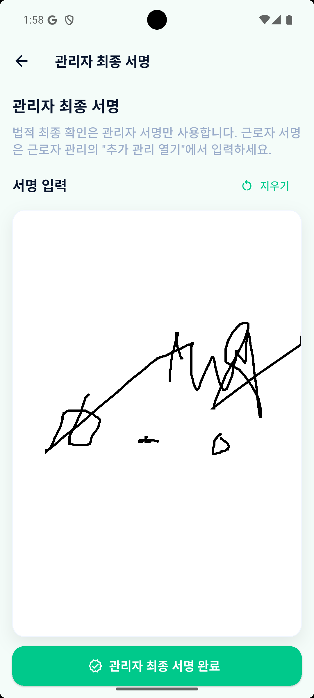
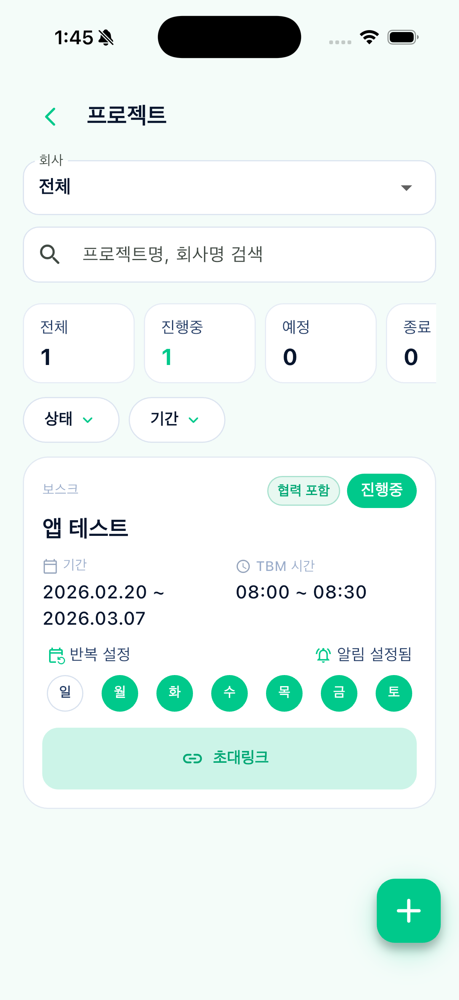
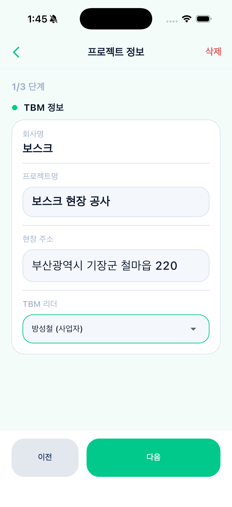
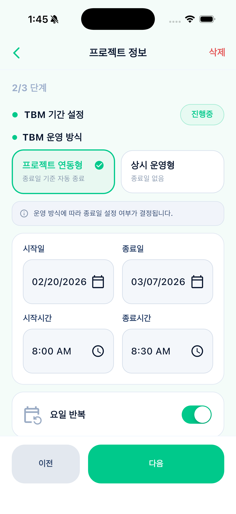

# Heinrix TBM Application

<p align="center">
  
</p>

<p align="center">
  건설 현장 TBM(Tool Box Meeting) 운영을 디지털화한 안전관리 플랫폼
</p>

<p align="center">
  
  
  
  
</p>

## 프로젝트 소개
Heinrix TBM Application은 현장 안전회의(TBM)의 생성, 참여자 관리, 서명 수집, PDF 보고서 생성을 하나의 흐름으로 통합한 앱입니다.  
본사 관리자, 협력업체, 근로자 역할별 운영 시나리오를 지원하며, Firebase 기반으로 실시간 데이터 동기화와 권한 제어를 수행합니다.

## 핵심 기능
- 프로젝트 생성/수정/삭제 및 참여 인원 모드 관리
- 본사/협력업체/근로자 권한 기반 접근 제어
- 현장 참여 요청 및 승인 프로세스
- TBM 참석/서명 관리
- TBM 문서 PDF 자동 생성 및 저장
- Firebase Functions 기반 집계/정합성 처리

## 앱 화면 가이드 (Home + 주요 화면)

### Home 화면
- 앱의 메인 대시보드 화면입니다.
- TBM 진행 카드, 공지사항, 하단 네비게이션(홈/알림/내정보)으로 핵심 업무를 빠르게 진입합니다.


### 메뉴 드로어 (위치 해석 완료)
- 회사/프로젝트 스코프 기준으로 주소가 정상 해석된 상태입니다.
- 운영자는 현재 현장 위치를 ID가 아닌 실제 주소로 확인할 수 있습니다.


### 회사 찾기 / 초대링크 가입
- 초대 링크 입력으로 회사 참여를 요청하거나, 검색으로 회사/현장을 조회합니다.
- "내 요청 내역" 탭으로 가입 요청 상태를 추적할 수 있습니다.


### 근로자/업체 관리
- 근로자/업체 탭 기반으로 인력 데이터를 통합 관리합니다.
- 검색, 정렬, 프로젝트 필터, 권한/소속 확인 및 편집이 가능합니다.


### TBM 보고서 관리
- 안전 문서 이력에서 일간/주간 보고서를 조회하고 검색합니다.
- 세션 상태(DRAFT 등)와 생성일을 기준으로 문서를 식별합니다.


### TBM 작성 (1/4 작업 정보)
- 프로젝트, 작업명, 작업 장소를 입력하는 첫 단계입니다.
- 하단 작업 목록에 세부 작업 항목을 추가하며 다음 단계로 진행합니다.


### TBM 확인 (2/4 사업장 및 작업정보)
- 회사/업체/관리자 정보와 작업 세부사항을 검토하는 단계입니다.
- 각 섹션 우측 편집 버튼으로 입력값을 즉시 수정할 수 있습니다.


### TBM 확인 (3/4 인원 및 현장사진)
- 참석 인원/미참석 인원, 서명 완료 현황을 요약으로 확인합니다.
- 근로자 관리 화면 진입 및 현장 사진 촬영/선택 업로드를 지원합니다.


### 근로자 추가/참석 관리
- 근로자 추가, 역할 지정, 참석(고정) 상태, 서명 완료 상태를 관리합니다.
- 근로자별 수정/삭제 액션으로 현장 인원 데이터를 실시간 정합화합니다.


### TBM 확인 (4/4 관리자 최종 서명)
- TBM 최종 확인 단계에서 관리자 서명을 입력하고, 필요 시 서명을 초기화할 수 있습니다.
- "관리자 최종 서명 완료" 액션으로 서명 데이터를 확정하고 문서 생성 흐름을 마무리합니다.



### 참조 PDF
- `test_tbm.pdf`는 TBM 작성 완료 후 생성되는 최종 문서 예시입니다.
- 관리자 최종 서명, 작업 정보, 참석 인원 정보가 PDF로 어떻게 정리되는지 확인할 수 있습니다.
- 문서 검토 시 서명 반영 여부와 필수 항목 누락 여부를 함께 점검하세요.

[test_tbm.pdf 보기](./lib/test_tbm.pdf)


### 프로젝트 정보 (1/3 TBM 기본 정보)
- 회사명, 프로젝트명, 현장 주소, TBM 리더를 입력하는 초기 설정 단계입니다.
- 이전/다음 버튼 기반 단계형 입력으로 프로젝트 생성 흐름을 관리합니다.



### 프로젝트 목록/운영 현황
- 회사 스코프 선택, 검색, 상태/기간 필터로 프로젝트를 조회합니다.
- 진행 상태, TBM 시간, 반복 요일, 초대링크 등 운영 정보를 카드 형태로 확인합니다.



### 프로젝트 정보 (2/3 기간 및 운영 방식)
- TBM 기간 설정과 운영 방식(프로젝트 연동형/상시 운영형)을 선택합니다.
- 시작일/종료일, 시작시간/종료시간, 요일 반복 여부를 한 화면에서 조정합니다.



### 프로젝트 정보 (3/3 참여 인원 모드)
- 참여 인원 모드(협력업체 포함/본사 인원 전용)를 선택해 운영 범위를 정의합니다.
- 업체/근로자 관리 진입, 참여 인원 현황 확인, 사전 알림 설정 후 최종 저장합니다.


## TBM ERD
- TBM 도메인의 컬렉션 관계(회사/프로젝트/세션/근로자/서명)를 시각화한 ERD를 연결합니다.
- 참고: 현재 저장소에는 `tbm_erd.png` 파일이 없으므로, 동일 경로에 파일 추가 시 즉시 표시됩니다.


## 기술 스택
- Frontend: Flutter, Provider
- Backend: Firebase Auth, Cloud Firestore, Cloud Functions(TypeScript)
- Infra: Firebase Hosting, Firebase Storage
- Document: PDF Engine(`pdf`, `pdf-lib` 연동)

## 아키텍처 요약
- Client: Flutter Screen/Controller/State/Widgets 모듈 구조
- Server: HTTP Cloud Functions + Firestore Rules 기반 권한 검증
- Data: 회사(`companies`) 중심 멀티 테넌트 모델 + 프로젝트/근로자/세션 하위 컬렉션

## 시작하기
```bash
flutter pub get
flutter run
```

## Functions 배포
```bash
cd functions
npm install
npm run build
firebase deploy --only functions
```

## 저장소 구조
```text
lib/
  feature/
    auth/
    home/
    tbm_form/
functions/
  src/
docs/
  architecture/
  data-model/
  education/
```

## 문서
- 역설계 문서: `docs/firestore_model_reverse_spec.md`
- 아키텍처 개요: `docs/education/00_overview.md`

## License
Private project. All rights reserved.
