# Heinrix TBM Application

<p align="center">
  
</p>

<p align="center">
  A digital safety management platform for construction site TBM (Tool Box Meeting) operations
</p>

<p align="center">
  
  
  
  
</p>

## Overview
The Heinrix TBM Application is a platform that integrates the entire workflow of on-site safety meetings (TBM)—from creation and participant management to signature collection and automated PDF report generation.  
It supports operational scenarios tailored for head office administrators, partner companies (subcontractors), and workers, while leveraging Firebase for real-time data synchronization and role-based access control.

## Core Features
- Manage project creation/modification/deletion and participant modes.
- Role-based access control (Head Office / Partner Company / Worker).
- Workflow for site participation requests and approvals.
- TBM attendance and signature management.
- Automated generation and storage of TBM documents in PDF format.
- Data aggregation and consistency handling via Firebase Functions.

## App Screen Guide (Home & Key Screens)

### Home Screen
- The main dashboard of the application.
- Quickly access core tasks via TBM progress cards, announcements, and the bottom navigation bar (Home / Notifications / My Profile).

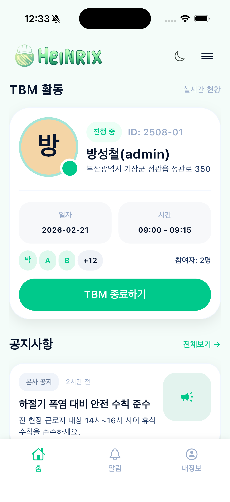

### Menu Drawer (Address Resolved)
- Displays the successfully resolved physical address based on the company or project scope.
- Operators can view the actual site location instead of just an ID.

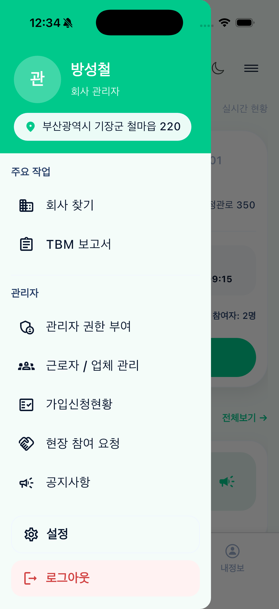

### Find Company / Join via Invite Link
- Request to join a company using an invite link, or search for a specific company/site.
- Track the status of your join requests via the "My Request History" tab.

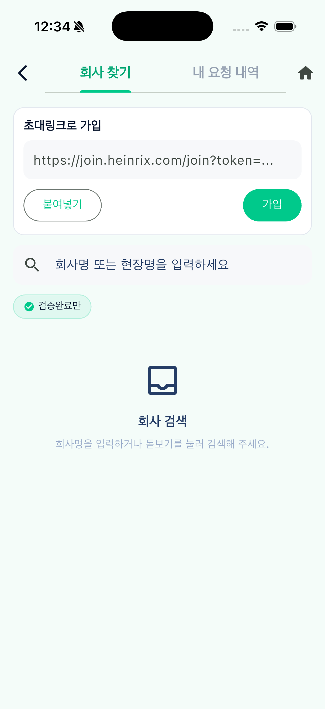

### Worker & Company Management
- Comprehensively manage workforce data separated by Worker and Company tabs.
- Supports search, sorting, project filtering, and editing of roles and affiliations.

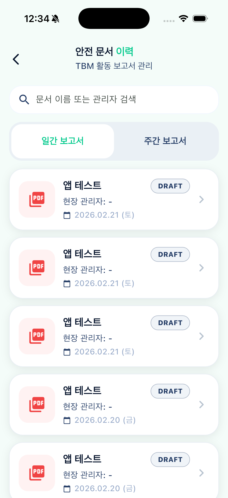

### TBM Report Management
- Search and view daily/weekly reports in the safety document history.
- Identify documents easily by session status (e.g., DRAFT) and creation date.

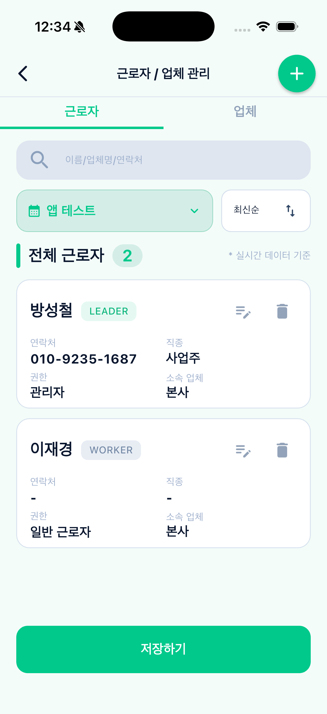

### Create TBM (1/4 - Task Information)
- The initial step to input the project name, task name, and task location.
- Add specific task items to the bottom list and proceed to the next step.

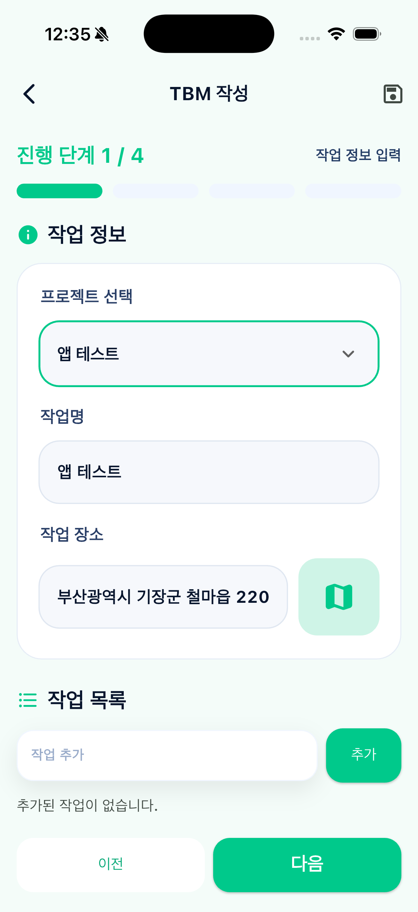

### Review TBM (2/4 - Workplace & Task Details)
- Review the company, partner, and administrator details along with task specifics.
- Instantly modify inputs using the edit button on the right side of each section.

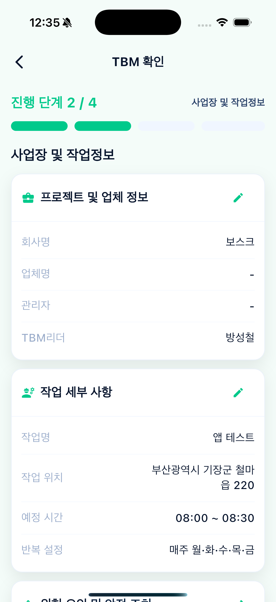

### Review TBM (3/4 - Personnel & Site Photos)
- Check a summary of attending/non-attending personnel and the signature completion status.
- Access the worker management screen and upload or take site photos directly.

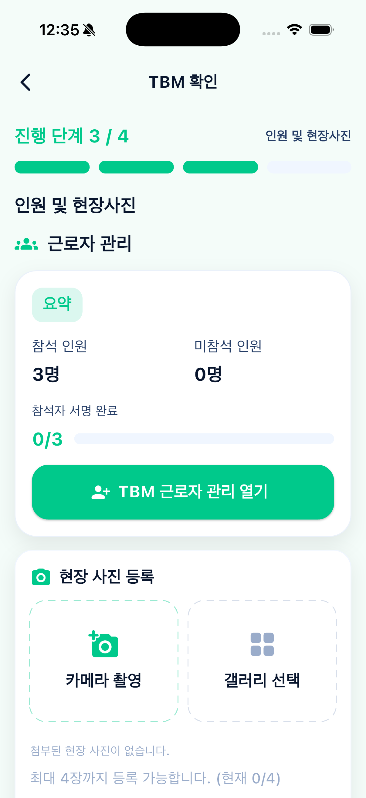

### Add Workers / Attendance Management
- Manage worker additions, role assignments, fixed attendance status, and signature status.
- Ensure real-time consistency of site personnel data through individual edit/delete actions.

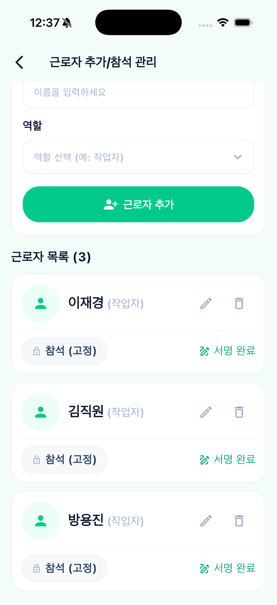

### Review TBM (4/4 - Admin Final Signature)
- The final TBM review step to input the administrator's signature (or reset it if necessary).
- Complete the document generation flow by confirming the "Admin Final Signature Complete" action.

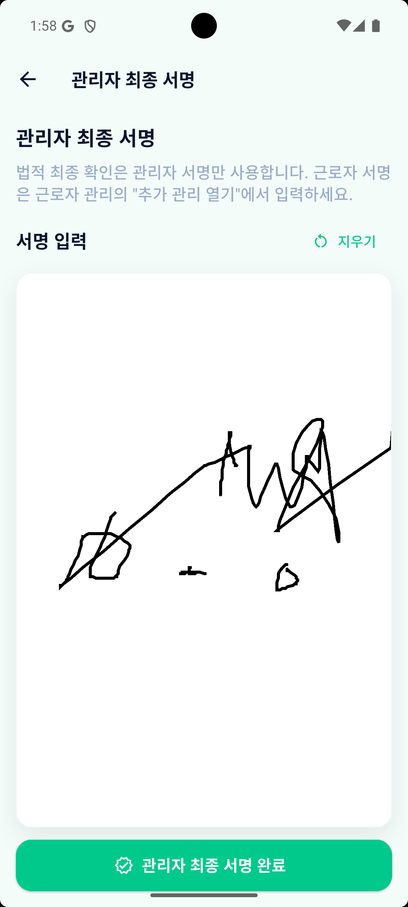

### Reference PDF
- `test_tbm.pdf` is an example of the final document generated upon completing a TBM.
- You can review how the admin's final signature, task details, and attendee information are structured in the PDF format.
- Use this to verify that all signatures are properly reflected and no required fields are missing.

[View test_tbm.pdf](./lib/test_tbm.pdf)

### Project Info (1/3 - Basic TBM Info)
- The initial setup phase to input the company name, project name, site address, and TBM leader.
- Navigate the project creation flow seamlessly using the Prev/Next buttons.

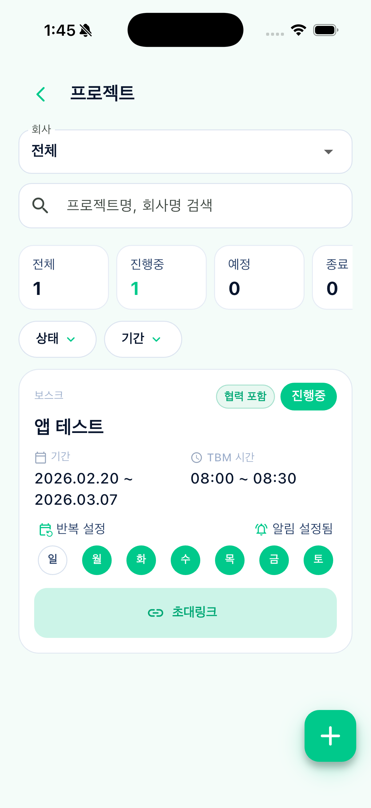

### Project List & Operations Status
- View projects using company scope selection, search bars, and status/period filters.
- Check operational details like progress status, TBM schedule, recurring days, and invite links in a card format.

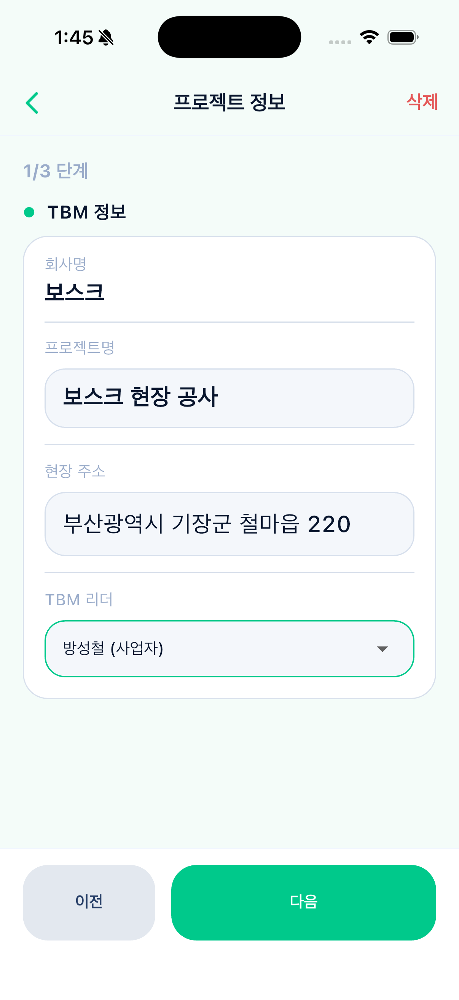

### Project Info (2/3 - Period & Operation Mode)
- Set the TBM operation period and choose the operation mode (Project-linked vs. Continuous).
- Adjust start/end dates, active times, and recurring days of the week on a single screen.

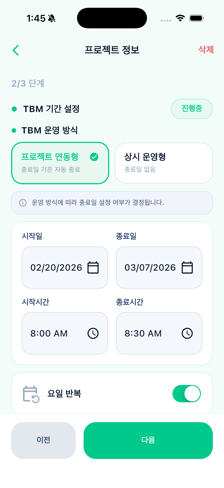

### Project Info (3/3 - Participant Mode)
- Define the operational scope by selecting the participant mode (Include Partner Companies vs. Head Office Personnel Only).
- Access company/worker management, review participant counts, set up advance notifications, and finalize the setup.

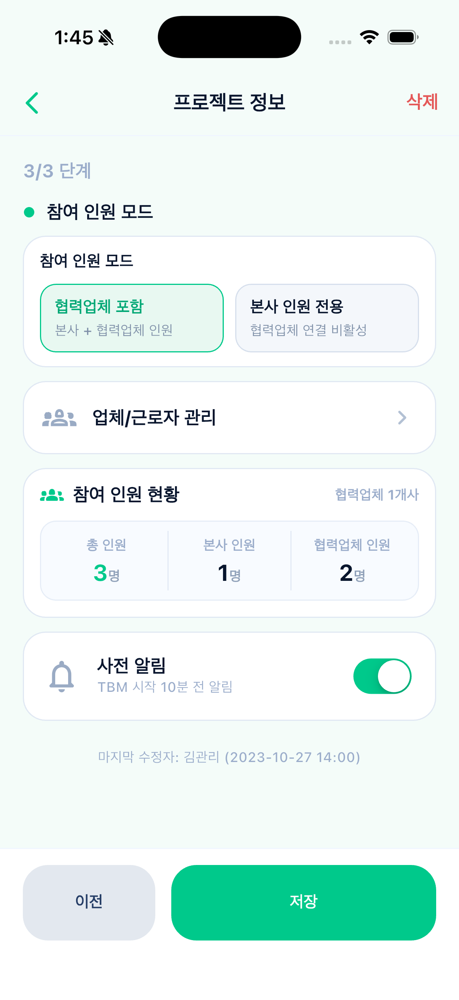

## TBM ERD
- An ERD visualizing the relational structure of the TBM domain collections (Company / Project / Session / Worker / Signature).
- Note: The `tbm_erd.png` file is not currently in the repository; once added to the designated path, it will be displayed below.

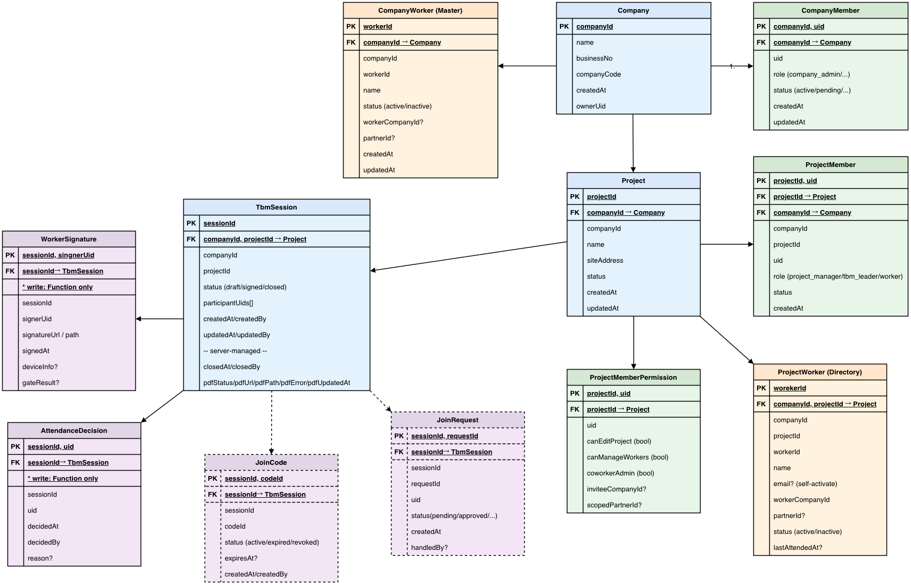

## Tech Stack
- Frontend: Flutter, Provider
- Backend: Firebase Auth, Cloud Firestore, Cloud Functions (TypeScript)
- Infra: Firebase Hosting, Firebase Storage
- Document: PDF Engine (Integrated with `pdf` and `pdf-lib`)

## Architecture Summary
- Client: Flutter module structure based on Screen / Controller / State / Widgets.
- Server: HTTP Cloud Functions combined with Firestore Rules for permission validation.
- Data: Multi-tenant model centered around the `companies` collection, utilizing sub-collections for projects, workers, and sessions.

## Getting Started
```bash
flutter pub get
flutter run
```

## Deploy Functions
```bash
cd functions
npm install
npm run build
firebase deploy --only functions
```

## Repository Structure
```text
lib/
  feature/
    auth/
    home/
    tbm_form/
functions/
  src/
docs/
  architecture/
  data-model/
  education/
```

## Documentation
- Reverse Engineering Spec: `docs/firestore_model_reverse_spec.md`
- Architecture Overview: `docs/education/00_overview.md`

## License
Private project. All rights reserved.
